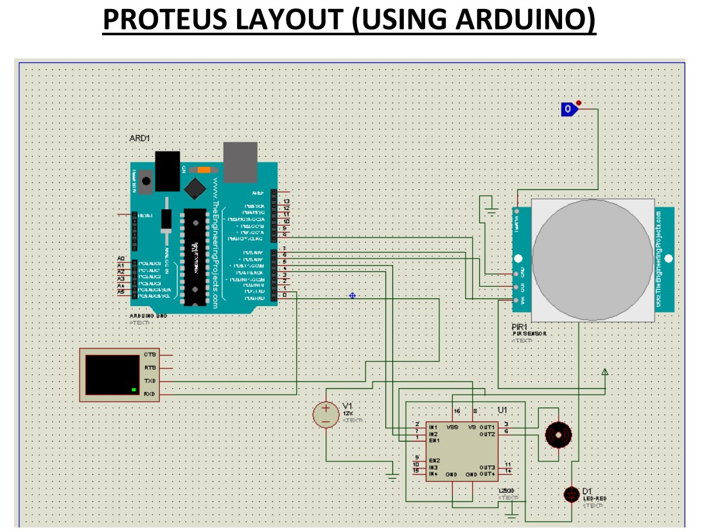

# Sliding-door-controller

We are realising this project (Automatic door sliding control system) using two ways using -
1. ATmega8 microcontroller and 
2. Arduino based microcontroller.

**1. ATmega Based**\
The project Automatic door sliding control system is basically having the control mechanism of 
identifying the presence of object radiating infrared rays (e.g. human beings).\ 
The identification is directly investigated through PIR sensor. PIR sensor directly gives the binary data in 
HIGH or LOW after identification. HIGH is generated when it sense infrared rays, otherwise it remains 
LOW.\
The output of the PIR sensor is directly controlled by the microcontroller and after that the door 
mechanism is operated by the controller itself according to the data provided to controller by PIR 
sensor.\
Door sliding mechanism is controlled by the DC motor using motor driver IC (L293D).
After detection of object motor will perform the function of door open, and after opening of door PIR 
sensor will again check the presence, if not then motor will perform the function of door close.
In between the door closing function if there is the presence again then the door will open automatically 
without closing completely.\

**2. Arduino Based**\
The control mechanism using arduino is similar to ATmega using PIR sensor and motor driver IC. In 
addition to the above method we have introduced a new functioning using virtual terminal (serial 
communication - USART, Bluetooth communication). In this new function we are providing the 
statistics/data of opening and closing activities directly to user using Bluetooth communication.
